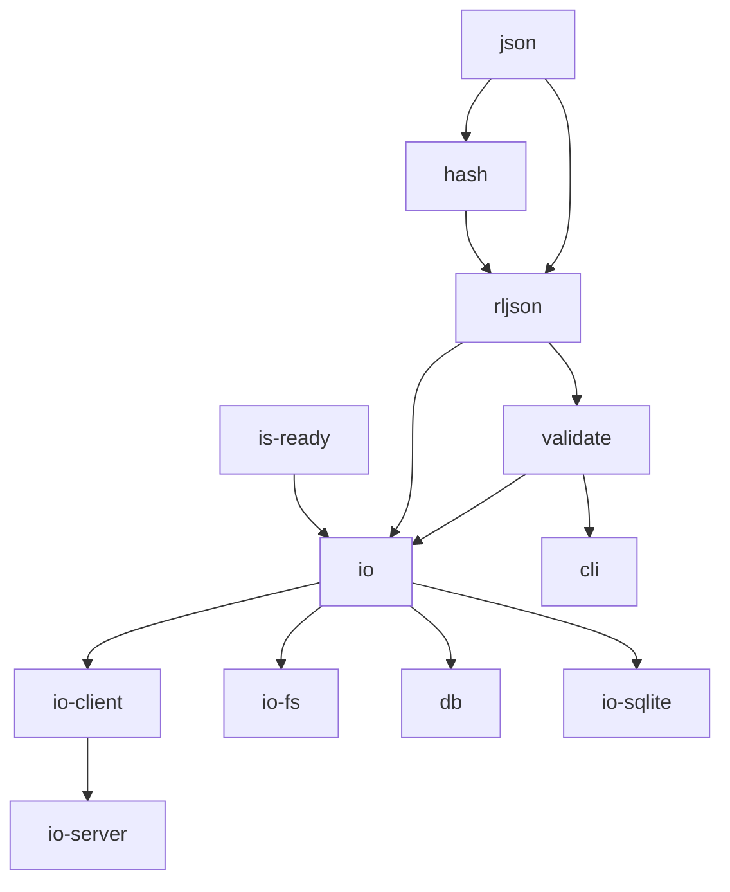

# Rljson

## Packages

```mermaid
graph TD
json --> hash
hash --> rljson
json --> rljson
is-ready --> io
rljson --> io
validate --> io
validate --> cli
rljson --> validate
io --> io-client
io --> io-fs
io-client --> io-server
io --> db
io --> io-sqlite
```
